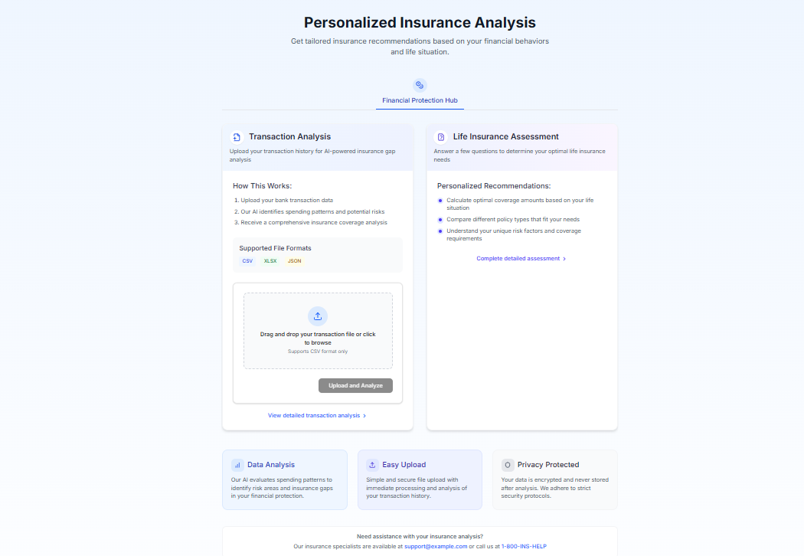
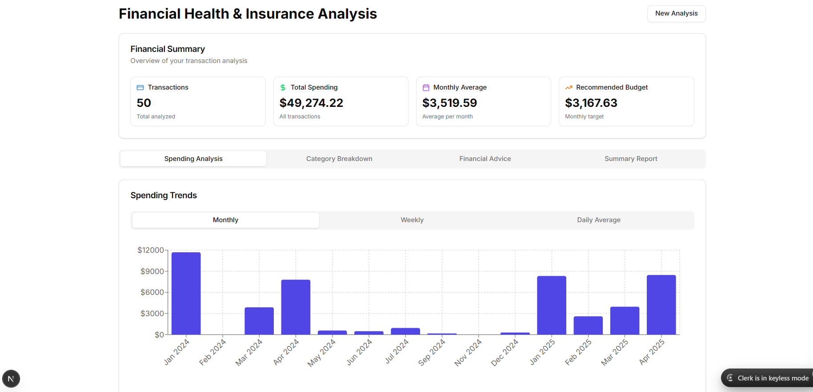
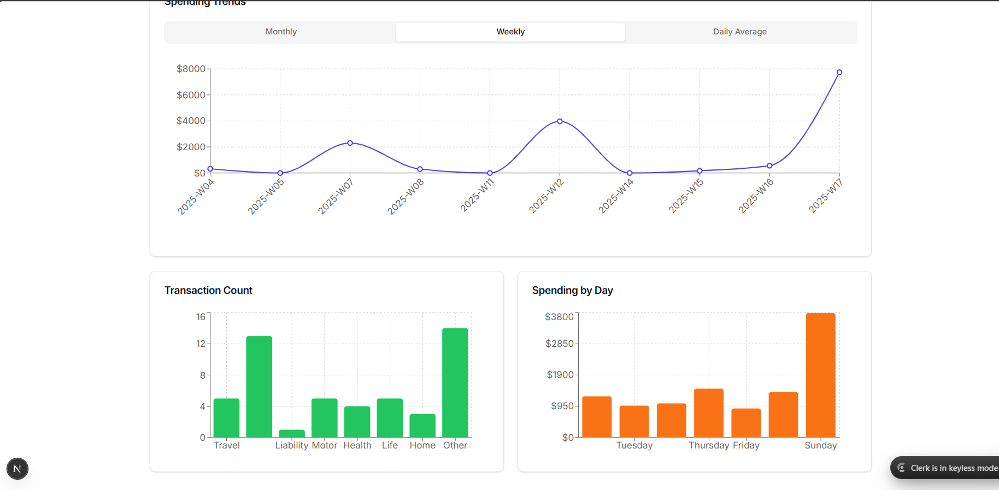
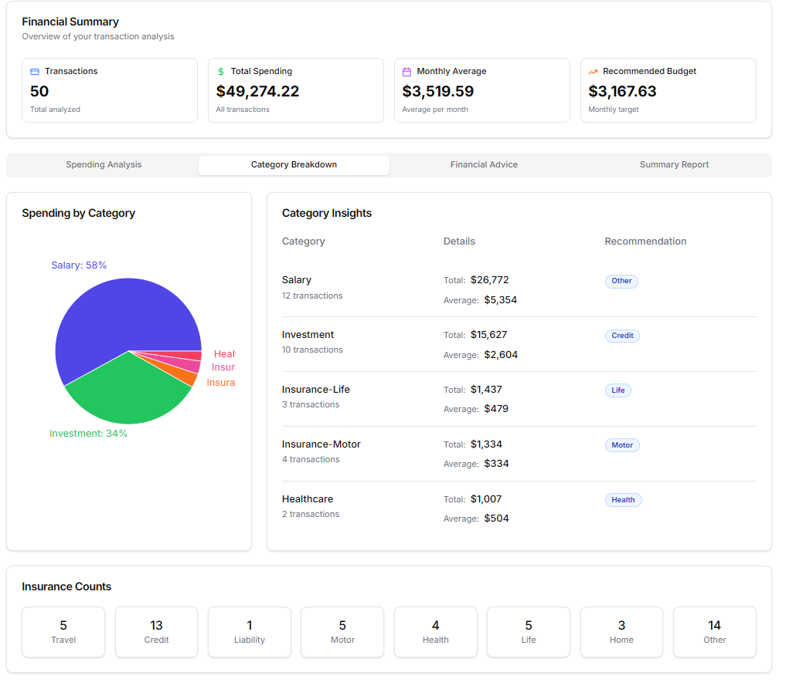
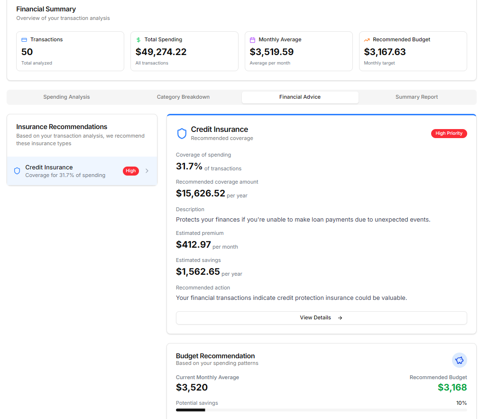
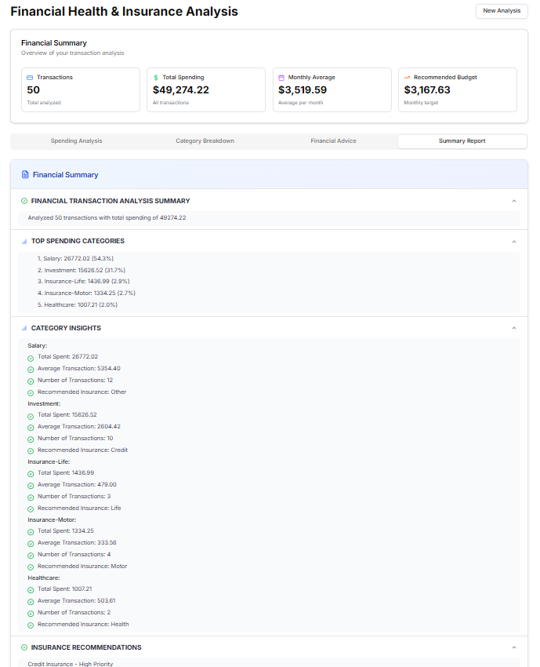
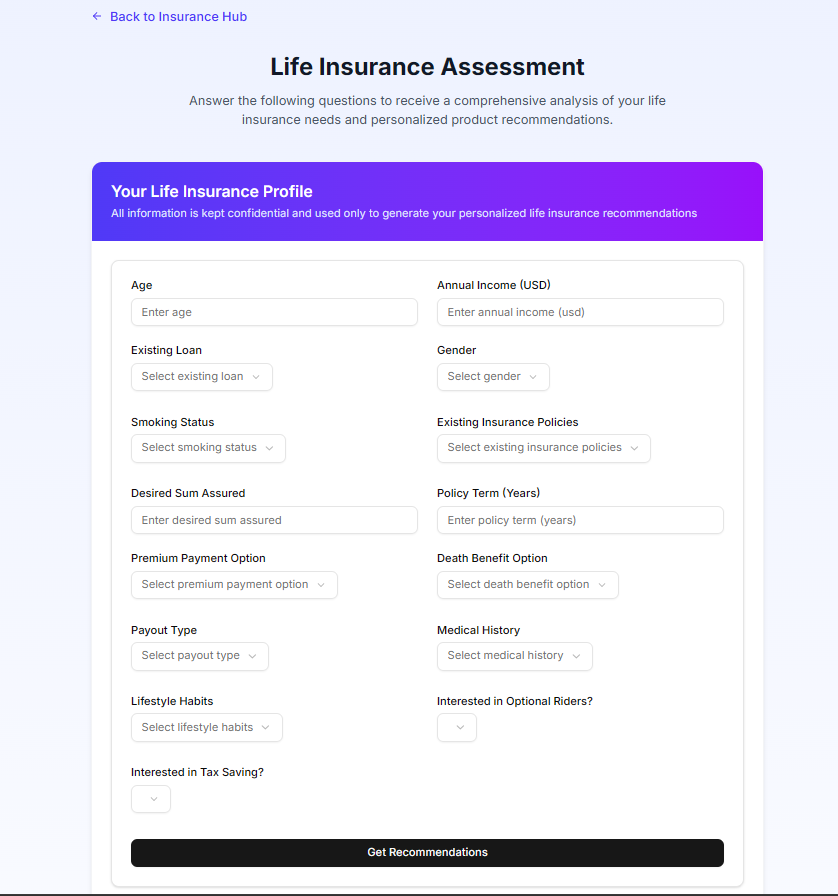
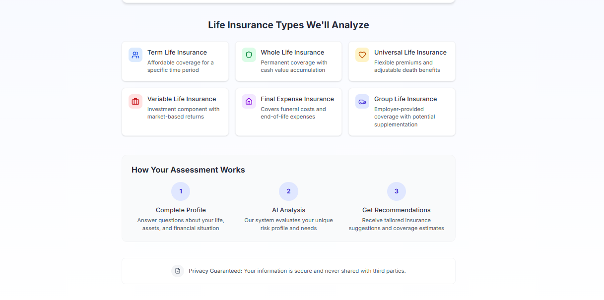

# 🧠 InsurIQ - AI-Powered Insurance Recommendation Platform

> Empowering users with intelligent, data-driven insurance decisions.

## 🔍 Overview

Millions of users unknowingly purchase insurance policies based on biased or uninformed recommendations by agents. **InsurIQ** is here to change that.  
Our platform helps users **understand, analyze, and choose the right insurance** based on real-life data — **transaction history, bank statements, UPI activity**, and **personal financial habits**.

No more guesswork. No more manipulation. Just smart insurance decisions.

---

## 🎯 Key Features

- 🔎 **Personalized Insurance Recommendation**  
  Upload your bank statement or UPI transaction history — InsurIQ analyzes it to recommend **exactly which type of insurance** (life, health, travel, car, credit) you need.

- 🧠 **AI-Powered Analysis & Prediction**  
  Using advanced ML models, we analyze:
  - Spending patterns
  - Income levels
  - Lifestyle indicators  
  ...to suggest which **life insurance plan** is best for you — with **maximum benefits and minimal cost**.

- 📊 **Risk & Benefit Analysis**  
  Know your **risk profile** and **benefit probability** from a given insurance plan before you invest.

- 🔗 **Future Integration with UPI/Banking APIs**  
  In future versions, we aim to support:
  - Direct integration with GPay and other UPI apps
  - Bank account linking for real-time data
  - Smart alerts and recommendations

- 🔍 **Insurance Market Trends (Coming Soon)**  
  Our models learn from macro data and user behavior to predict what most people with similar profiles are buying and benefiting from.

---

## 🛠️ Tech Stack

| Tech       | Purpose                                |
|------------|----------------------------------------|
| Python     | Data processing, AI/ML pipelines       |
| FastAPI    | Backend APIs & AI endpoints            |
| HuggingFace Spaces | Model hosting & prototyping     |
| Spring Boot| Microservices & advanced backend logic |
| Next.js    | Frontend framework                     |
| TypeScript | Strongly typed frontend development    |

---

## 🚀 How It Works

1. **User Uploads Data**  
   - Upload bank statements or UPI transaction history in PDF or CSV format.

2. **AI/ML Model Analyzes the Data**  
   - Spending categories
   - Risk profile
   - Income vs. expense behavior

3. **Model Recommends Insurance Types**  
   - Life, Health, Travel, Vehicle, Credit, etc.

4. **For Life Insurance:**
   - Predicts the best plan based on profile
   - Performs risk-benefit scoring
   - Suggests where to get **maximum benefit with minimal premium**

---

## 📸 Screenshots

### 🖥️ Landing page

### 🖥️ Dashboard UI

### 📤 Spending analysis

### 📄 Category wise

### 📊 Insurence Recommandation

### 💡Summary of analysis

### 💡form assesment for life insurence 

### 💡details how it works

---

## 🧪 Models in Progress

- **Insurance Type Classifier** based on transaction patterns  
- **Life Insurance Recommender** using:
  - Lifestyle habits
  - Income analysis
  - Family dependencies  
- **Risk-Benefit Analyzer** to estimate:
  - Return potential
  - Claim likelihood

---

## 💡 Future Roadmap

- ✅ PDF/CSV parser for transaction data  
- 🔄 GPay / UPI direct integration  
- 🧠 Personalized health/travel/credit insurance models  
- 🌍 Regional insurance policy comparison  
- 📈 User habit evolution tracking  
- 🔐 Secure financial data storage and encryption

---

## 🤝 Contributing

Coming soon — we will open contributions for:
- Model development
- Insurance datasets
- Frontend UI enhancements

---

## 🛡️ Disclaimer

This tool is intended for **educational and experimental use only**. Please consult with a licensed insurance advisor for final decisions. We do not sell or promote any insurance company.

---

